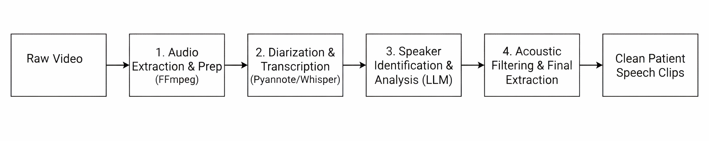
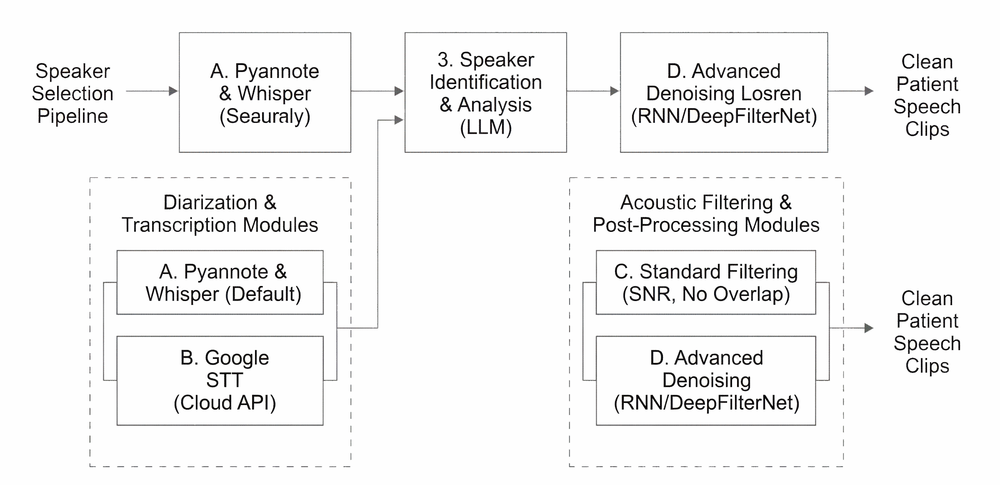
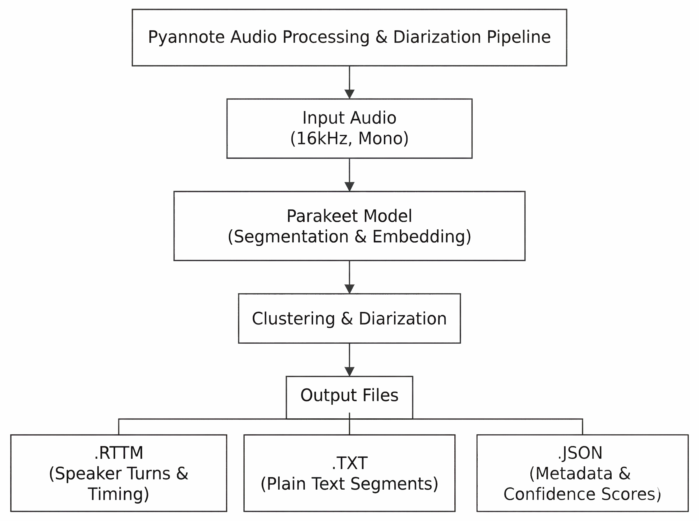
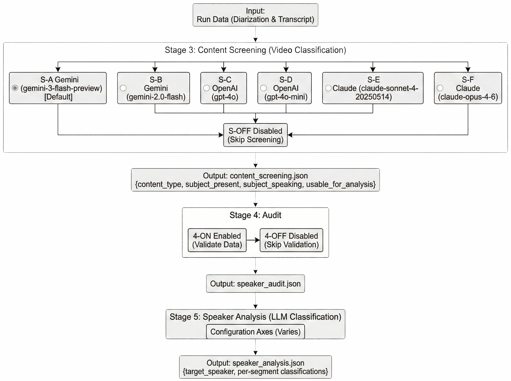
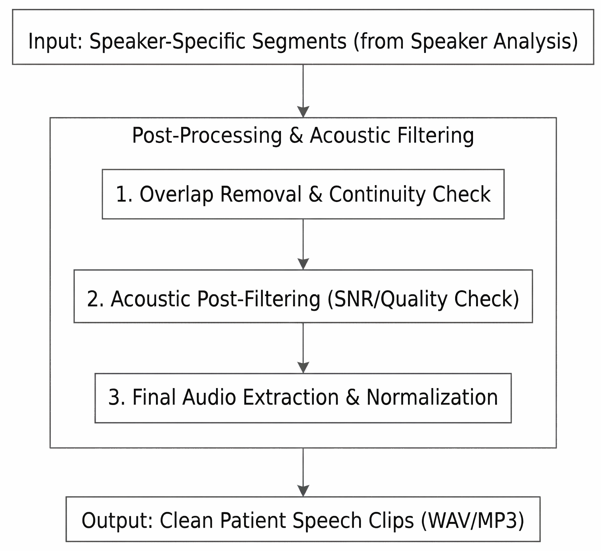

# Speaker Selection Pipeline

This document provides a detailed description of the Speaker Selection Pipeline: what it does, why each part exists, how the "golden pipeline setup" works end-to-end, which alternative options are available for experimentation, and what caveats to be aware of.

---

## 1. The purpose of the pipeline

The DementiaNet dataset is the only publicly available dataset (with no university affiliation). It consists of raw video interviews with famous people, actors, politicians, and athletes who were known to have dementia or Alzheimer's, and healthy controls. Each video typically contains at least two speakers: the **subject** (patient) and an **interviewer** (clinician, journalist, family member). Some videos contain additional speakers, narrators, or background noise.


The original initiative of this idea and dataset belongs to Shreyas Gite, and can be accessed from the repository here:   https://github.com/shreyasgite/dementianet 

It is, however, notoriously time-consuming to search for the parts of the videos where clear speech of the person of interest is present, and requires a lot of processing hours. 


This project is an attempt to automate the curation of similar datasets, where there are videos of interviews and there is a need to check the content quality and find the speech samples from the person of interest. The goal is to produce a clean audio dataset containing **only the subject's speech**, suitable for downstream voice biomarker analysis (e.g., with MedGemma or similar medical ML models). This means solving several hard problems simultaneously:

1. **Speaker separation**: Diarisation tells you *when* each speaker talks, but assigns anonymous labels (SPEAKER_00, SPEAKER_01). It does not tell you *who* is the patient.
2. **Speaker identification**: An LLM reads the transcript with patient metadata (name, age, diagnosis) and determines which anonymous speaker label belongs to the person of interest.
3. **Content validation**: Not all videos are usable if the video search was performed by an automated system with the use of agentic AI. Some are tributes, obituaries, or music performances where the subject never actually speaks.
4. **Quality control**: ASR engines can produce erroneous transcriptions for silence or noise segments. Background music, crosstalk, and low-quality audio must be filtered out. (When using Whisper as the ASR source, specific hallucination detection is available via quality metrics; the golden pipeline uses Pyannote's transcription instead and relies on the LLM and acoustic post-filter for quality control.)
5. **Dataset balance**: Without caps, some subjects would have 30 minutes of speech and others 30 seconds. The pipeline enforces a per-run budget (default 5 minutes).

The pipeline handles all of this automatically, at scale, with minimal human intervention.





---

## 2. The Golden pipeline setup (best results profile after my test)

The golden pipeline is the preserved configuration that produced the best results. It is the recommended starting point for all new processing. It runs in two distinct phases, deliberately split because they have different cost and computation profiles.

### Phase 1: Bootstrap (audio extraction + cloud diarisation & transcription)

**Config**: `configs/golden_pipeline_bootstrap_api_precision1.yaml`

**What it does**: Extracts audio from every video file (FFmpeg), then submits audio to the Pyannote cloud API, which performs both speaker diarisation and transcription in a single job. The Pyannote API produces the transcript that all downstream stages consume.

Stage 1 is configured with `asr.skip: true` in the golden config, so it **only extracts audio** — no Whisper model is loaded and no GPU time is spent on ASR. The Pyannote API (Stage 2 with `write_standard: true`) writes all transcript files directly. To run fully local without the API, set `asr.skip: false` in Stage 1 and disable Stage 2 (see Section 3).

**Why it's separate**: This phase involves cloud API calls (Pyannote precision-1, which costs real money and can take hours per job) and GPU computation for audio preparation. You want to run this once and never repeat it unless the source data changes.

**Command**:
```
python orchestrate_full_pipeline.py --config configs/golden_pipeline_bootstrap_api_precision1.yaml
```

**Stages enabled**: Stage 1 (audio extraction only, `asr.skip: true`) + Stage 2 (Pyannote API diarisation + transcription). Everything else is disabled.

### Intermediate step: Content screening

**What it does**: An LLM pass that validates whether each video actually contains the subject speaking (not just others talking about the subject).

**Why it exists**:  Some files labelled as "interviews" are actually obituaries, tributes, or music performances. Without screening, the speaker analysis LLM would try to find the patient's voice in a video where they never speak, potentially misidentifying someone else.

**Command**:
```
python helper_scripts/run_content_screening.py --batch --runs-root <runs_path> --csv-dir <csv_path> --provider gemini --model gemini-3-flash-preview --force
```

### Intermediate step: Audit

**What it does**: Pre-validation check that ensures each run has sufficient data quality before spending LLM tokens on speaker analysis.

**Command**:
```
python helper_scripts/run_audit.py --batch --runs-root <runs_path> --csv-dir <csv_path> --force
```

### Phase 2: Finalise (LLM Analysis + Extraction)

**Config**: `configs/golden_pipeline_finalize_llm_extract.yaml`

**What it does**: Runs an audit, LLM speaker analysis (identifies who the patient is), and final audio extraction (cuts clips, filters acoustically, and denoises).

**Why it's separate**: This phase uses cheap, fast LLM calls and signal processing. You can re-run it with different LLM models, different extraction parameters, or different acoustic filter thresholds without redoing the expensive bootstrap work.

**Command**:
```
python orchestrate_full_pipeline.py --config configs/golden_pipeline_finalize_llm_extract.yaml
```

**Stages enabled**: Stage 4 (Audit) + Stage 5 (Speaker Analysis) + Stage 7 (Extraction). Everything else is disabled.

### Golden pipeline settings

These settings define the golden profile and should not be changed for control-group processing:

| Setting | Value | Why |
|---------|-------|-----|
| Pyannote API model | `precision-2` | Highest diarisation quality |
| Transcription model | `parakeet-tdt-0.6b-v3` | API-provided transcription aligned to speaker turns |
| Exclusive diarisation | `true` | Each moment assigned to exactly one speaker (no overlaps) |
| Confidence scores | `true` + `turn_level_confidence: true` | Per-turn confidence used by downstream quality scoring |
| `write_standard` | `true` | API results written as canonical files for downstream stages |
| Extraction mode | `continuity_first` | Groups adjacent segments into natural speech phrases |
| Per-run cap | `5.0 minutes` | Prevents dataset imbalance |
| Min segment duration | `4.0 seconds` | Clips shorter than this aren't useful for voice analysis |
| Acoustic post-filter | `enabled` | Rejects music, noise, and acoustic outliers |
| Denoise | `enabled` at strength `0.65` | Cleans background noise via DeepFilterNet |

---

## 3. Where the transcript comes from (golden pipeline vs. alternatives)

Stage 1 has a config flag `asr.skip` that controls whether Whisper ASR runs or is skipped entirely. In the golden pipeline it is set to `true` (audio extraction only); in the local/template config it defaults to `false` (full Whisper ASR).

### In the golden pipeline

The **Pyannote cloud API** produces the transcript that all downstream stages consume. Stage 1 runs with `asr.skip: true`, so it only extracts audio (`audio_base.wav` + `audio_16k.wav`) — no Whisper model is loaded, no GPU time is spent on ASR, and no transcript files are written by Stage 1. The `run.json` records `asr_skipped: true` with `status: "success"`.

Stage 2 then runs with `transcription: true` and `write_standard: true` (both set in the golden config), which:

1. Performs speaker diarisation (who speaks when)
2. Runs its own ASR model (`parakeet-tdt-0.6b-v3`) to produce a transcript aligned to those speaker turns
3. **Writes** the canonical files `transcript.json`, `segments_detailed.json`, `words.json`, and `asr_info.json`

The files that Stage 5 (Speaker Analysis) and Stage 7 (Extraction) read contain **Pyannote API output only**. Each transcript segment has: `id`, `start`, `end`, `text`, `speaker`, and `speaker_confidence`. They do **not** contain Whisper-specific quality metrics (`avg_logprob`, `no_speech_prob`, `compression_ratio`).

This has a concrete downstream consequence: the Stage 5 pre-filter checks for the presence of `no_speech_prob` in each segment. When it is absent (as it is with Pyannote API segments), the pre-filter sets `pre_filter_skipped: true` and assigns all segments status `"pass"` without any quality annotations. The LLM receives the transcript without `[AUTO-NOISE]` or `[FLAGGED]` markers. This is acceptable because the Pyannote API's diarisation confidence scores and the LLM's own judgement provide sufficient quality signal.

### When Stage 2 Is disabled (local Whisper path)

To run fully local without the Pyannote API, set `asr.skip: false` in Stage 1 and disable Stage 2. Stage 1 then loads Whisper (e.g., `large-v3`) and produces the primary transcript. In this case:

- `transcript.json` and `segments_detailed.json` contain Whisper output with full ASR quality metrics
- The Stage 5 pre-filter operates at full capacity: segments are checked against `no_speech_prob`, `compression_ratio`, `avg_logprob`, and the hallucination phrase list
- There are no speaker labels from diarisation (unless Stage 3 local diarisation is enabled)
- The LLM must work from transcript text alone without per-segment speaker assignment

This is the local fallback path. It works, but produces lower-quality results because Whisper alone does not provide speaker identity.

### Summary

| Configuration | Stage 1 `asr.skip` | Transcript Source | ASR Model | Has Speaker Labels | Has Whisper Quality Metrics | Pre-Filter Active |
|--------------|-------------------|------------------|-----------|-------------------|---------------------------|-------------------|
| Golden pipeline (Stage 2 enabled, `write_standard: true`) | `true` | Pyannote API | parakeet-tdt-0.6b-v3 | Yes | No | No (skipped) |
| Local Whisper path (Stage 2 disabled) | `false` | Whisper | faster-whisper large-v3 | No | Yes | Yes (full) |
| Stage 2 enabled, `write_standard: false` | `false` | Whisper (canonical) + Pyannote (*_api.json copies) | Both | In *_api.json only | In canonical files | Yes (full) |

---

## 4. Detailed stage-by-stage reference

### Stage 1: Audio preparation (+ optional ASR)

**Purpose**: Convert raw video to standardised audio files. Optionally runs Whisper ASR for a local transcript.

**With `asr.skip: true` (golden pipeline)**: Audio extraction only. Produces `audio_base.wav` and `audio_16k.wav`. No Whisper model is loaded, no GPU time is spent on transcription. The `run.json` records `asr_skipped: true` with `status: "success"`. Stage 2 (Pyannote API with `write_standard: true`) writes all transcript files.

**With `asr.skip: false` (local Whisper path)**: Full audio extraction + ASR. The Whisper transcript becomes the primary transcript for all downstream stages, including quality metrics used by the pre-filter. Use this when Stage 2 is disabled.

**Process**:
1. Extract audio track from video using FFmpeg into `audio_base.wav` (PCM s24le codec)
2. Resample to 16kHz mono as `audio_16k.wav` (the standard input format for all speech models)
3. If `asr.skip: false`: run ASR using faster-whisper (or whisperx) to produce timestamped transcript

**Output files** (in `metadata/`):

Always written:
- `run.json`: Pipeline status, config, timings

When `asr.skip: false` (ASR runs):
- `asr_info.json`: Language detected, language probability, total duration, duration after VAD
- `transcript.json`: Segment-level transcript (id, start, end, text, avg_logprob, no_speech_prob, compression_ratio)
- `segments_detailed.json`: Same as transcript but includes per-word timestamps within each segment
- `words.json`: Flat list of all words with start/end times and probability scores

When `asr.skip: true` (golden pipeline): none of the above four files are written by Stage 1. Stage 2 writes them instead.

**Whisper ASR quality metrics** (only present when Stage 2 does not overwrite, i.e., when `write_standard: false` or Stage 2 is disabled):
- `avg_logprob`: Average log probability of the tokens. Closer to 0.0 = higher confidence. Values around -0.3 to -0.5 are typical for clear speech. Below -1.0 is considered low confidence.
- `no_speech_prob`: Probability that the segment contains no actual speech. Above 0.6 = likely silence, noise, or music.
- `compression_ratio`: Ratio of compressed to uncompressed token representation. Above 2.4 suggests Whisper is hallucinating (generating repetitive or fabricated text for non-speech audio).

**Configuration options**:

| Parameter | Default | Options | Notes |
|-----------|---------|---------|-------|
| `skip` | `false` | Boolean | `true` = audio extraction only (no Whisper); `false` = run ASR |
| `backend` | `faster-whisper` | `faster-whisper`, `whisperx` | faster-whisper is more stable |
| `model_name` | `large-v3` | Any Whisper model size | large-v3 is ~3GB, needs decent GPU |
| `language` | `en` | Any ISO language code | Forces language instead of auto-detect |
| `device` | `cuda` | `cuda`, `cpu` | CPU is much slower |
| `compute_type` | `float16` | `float16`, `int8`, `float32` | float16 is the GPU sweet spot |
| `beam_size` | `5` | Integer | Higher = slower but potentially better |
| `batch_size` | `16` | Integer | Reduce if GPU runs out of memory |
| `vad_filter` | `true` | Boolean | Voice Activity Detection pre-filter |
| `force` | `false` | Boolean | Re-process even if output exists |
| `max_files` | `null` | Integer or null | Limit number of files to process |

**Caveats**:
- With `asr.skip: true`, none of the ASR-related caveats below apply - Stage 1 finishes in seconds per file.
- Whisper large-v3 requires a GPU with sufficient VRAM. If you get OOM errors, reduce `batch_size` or use a smaller model.
- The model is loaded once and reused across all files in the batch. If the process crashes mid-batch, completed files are preserved (file-based state).
- Whisper sometimes hallucinates "Thank you for watching", "Please subscribe", or similar YouTube-style phrases on silence. The pre-filter in Stage 5 catches these by checking against a known hallucination phrase list.

---

### Stage 2: Cloud diarisation (Pyannote API)

**Purpose**: High-precision speaker diarisation using Pyannote's commercial cloud service.



**Process**:
1. Scan for runs that have audio but no API results yet
2. Upload audio to Pyannote's ingress endpoint
3. Submit a diarisation job with configured parameters
4. Poll for job completion (default every 20-30 seconds, timeout up to 3 days)
5. Download results, normalise, and write output files

**Output files** (in `metadata/`):
- `pyannote_job.json`: Job metadata (job ID, status, timestamps)
- `pyannote_job_output.json`: Raw API output
- `pyannote_job_result.json`: Full job result object
- `diarization_api.json`: Speaker turns with confidence scores
- `asr_info_api.json`: Duration and transcription metadata
- `transcript_api.json`: Transcript segments aligned to speaker labels
- `segments_detailed_api.json`: Detailed segments with word-level data
- `words_api.json`: Word-level transcription from API

When `write_standard: true`: Also writes non-suffixed canonical versions (`transcript.json`, `segments_detailed.json`, etc.) that overwrite Stage 1's Whisper output.

**Configuration options**:

| Parameter | Default | Options | Notes |
|-----------|---------|---------|-------|
| `model` | `precision-2` | `precision-1`, `precision-2`, `community-1` | precision-1 is best but most expensive |
| `transcription` | `true` | Boolean | Also run transcription alongside diarisation |
| `transcription_model` | `parakeet-tdt-0.6b-v3` | String | ASR model used by the API |
| `exclusive` | `true` | Boolean | Each moment assigned to exactly one speaker |
| `confidence` | `true` | Boolean | Include confidence scores in output |
| `turn_level_confidence` | `true` | Boolean | Per-turn confidence (not just per-segment) |
| `write_standard` | `false` (template), `true` (golden) | Boolean | Write canonical files for downstream |
| `num_speakers` | `null` | Integer or null | Force exact speaker count |
| `min_speakers` | `null` | Integer or null | Minimum expected speakers |
| `max_speakers` | `null` | Integer or null | Maximum expected speakers |
| `submit_only` | `false` | Boolean | Submit jobs without polling |
| `poll_only` | `false` | Boolean | Only poll existing jobs |
| `poll_interval_s` | `20` | Integer | Seconds between status checks |
| `timeout_s` | `259200` | Integer | Total timeout (3 days) |
| `retry_failed` | `false` | Boolean | Re-submit previously failed jobs |
| `force` | `false` | Boolean | Re-submit even if results exist |

**API retry behaviour**: Retryable HTTP codes (429, 500, 502, 503, 504) trigger exponential backoff starting at 1 second, doubling per attempt, capped at 60 seconds, up to 5 retries per request.

**Caveats**:
- **This costs money.** The precision-1 model is the expensive tier. Disable Stage 2 for budget-conscious experimentation.
- Jobs are asynchronous and can take hours for long recordings. The 3-day timeout exists because very long audio files genuinely take that long.
- `submit_only` and `poll_only` modes let you decouple submission from result collection, useful for large batches where you want to submit everything first, then collect results later.
- If a job fails, it won't be retried unless `retry_failed: true` is set.

---

### Stage 3: Local Diarisation (Pyannote Community Model)

**Purpose**: Free, local alternative to Stage 2 cloud diarisation. Lower quality but no API cost.

**Process**: Runs the `pyannote/speaker-diarization-community-1` model locally on GPU against `audio_16k.wav`.

**Output files**:
- `diarization_local.json`: Speaker turns (start, end, speaker_label)
- `diarization_local.rttm`: Standard RTTM format for interoperability with other tools

**Configuration options**:

| Parameter | Default | Options | Notes |
|-----------|---------|---------|-------|
| `model` | `pyannote/speaker-diarization-community-1` | String | HuggingFace model path |
| `hf_token_env` | `HF_TOKEN` | String | Env var name for HuggingFace token |
| `device` | `auto` | `auto`, `cuda`, `cpu` | auto selects CUDA if available |
| `skip_if_cloud_submitted` | `true` | Boolean | Don't run if API diarisation exists |
| `skip_existing_local` | `true` | Boolean | Don't run if local results exist |
| `max_runs` | `null` | Integer or null | Limit processing count |
| `max_audio_hours` | `null` | Float or null | Limit by total audio duration |

**Caveats**:
- Requires a HuggingFace token because the model is gated (you must accept the license on huggingface.co first).
- Quality is noticeably lower than precision-1, especially for conversations where speakers have similar voices or there are more than 2 speakers.
- With `skip_if_cloud_submitted: true` (default), this stage becomes a fallback-only path: it only processes runs that were never sent to the cloud API.

**When to use**: When you want to avoid API costs entirely, or as a supplement for runs that failed in the cloud API.

---

### Stage 4: Audit (Pre-Analysis Validation)

**Purpose**: Validate that each run has sufficient data quality before spending LLM tokens on speaker analysis.

**Process**:
1. Load `speaker_analysis.json` (if it exists from a prior run)
2. Load transcript to get segment text
3. Look up patient metadata from CSV files
4. Check audio duration, metadata completeness, and data integrity
5. Optionally call an LLM for deeper validation

**Output**: `speaker_audit.json`

**Configuration**:

| Parameter | Default | Notes |
|-----------|---------|-------|
| `force` | `false` | Re-audit even if output exists |

**Caveats**:
- Should always run **before** Stage 5 (Speaker Analysis). Skipping it means the LLM might waste calls on runs with unusable data.
- In the golden pipeline, this is enabled with `force: true` to ensure every run is audited fresh.

---

### Stage 5: Speaker analysis 

**Purpose**: Use an LLM to determine which diarisation speaker label (SPEAKER_00, SPEAKER_01, etc.) corresponds to the patient.

This is the heart of the pipeline. Everything before this stage prepares the data; everything after this stage consumes its decision.



#### Step 5a: Pre-filtering

Before the LLM sees any segments, a pre-filter attempts to annotate them based on ASR quality metrics.

**In the golden pipeline, this step is effectively a no-op.** The Pyannote API transcript (which overwrites the canonical files via `write_standard: true`) does not contain Whisper-specific metrics (`no_speech_prob`, `avg_logprob`, `compression_ratio`). The pre-filter checks for the presence of `no_speech_prob` in the first segment; when absent, it sets `pre_filter_skipped: true` and assigns all segments status `"pass"` without annotations. The LLM receives the raw transcript without quality markers.

**When Stage 2 is disabled** (Whisper transcript is the primary source), the pre-filter operates at full capacity:

| Condition | Status Assigned | Meaning |
|-----------|----------------|---------|
| `no_speech_prob > 0.6` | `noise` | Likely silence or non-speech audio |
| Duration < 0.5s AND word count <= 1 | `noise` (via `very_short`) | Too short to be meaningful |
| `compression_ratio > 2.4` | `flagged_hallucination` | Whisper likely fabricated text |
| Text matches hallucination phrase list | `flagged_hallucination` | Known Whisper artifacts |
| Same phrase appears 3+ times | `flagged_hallucination` | Repetitive hallucination |
| `avg_logprob < -1.0` | `flagged_low_confidence` | ASR very uncertain about transcription |
| None of the above | `pass` | Clean segment |

**Known hallucination phrases**: "thank you for watching", "thanks for watching", "please subscribe", "like and subscribe", "subtitles by", "captions by", "translated by", "transcribed by"

In the Whisper path, all segments still proceed to the LLM, but flagged segments carry annotation markers (`[AUTO-NOISE]`, `[FLAGGED: reason]`) so the LLM can factor quality into its confidence scores.

#### Step 5b: Context assembly

The pipeline looks up the patient in the CSV metadata files:
- **Dementia group**: `DementiaNet_merged_completed_patients_with_dementia.csv`
- **No Dementia group**: `DementiaNet - no dementia.csv`

Fields extracted and provided to the LLM:
- Name (always present, derived from directory structure)
- Gender (if available)
- Birth year and death year (presented as "lived" range)
- Dementia type (dementia group only)
- First symptoms year (dementia group only)
- Language (if available)

This context helps the LLM understand who they're looking for. For example, knowing the patient is "Mary, 75 years old, female" helps distinguish her from a younger male interviewer.

#### Step 5c: LLM batching and classification

Long transcripts are split into batches of **50 segments per LLM call** to stay within context limits. Each batch is sent with:

- **System context**: 10 classification rules instructing the LLM to classify every segment as `subject`, `interviewer`, `narrator`, `other`, or `noise`, with confidence scores and reasoning.
- **Patient context block**: Name, demographics, diagnosis info
- **Formatted transcript**: Each segment presented as `[SEGMENT_ID] (START-END seconds): TEXT` with quality annotations

**Output format**: Pipe-delimited plain text (deliberately NOT JSON, because LLMs are more reliable at producing delimited text than valid JSON):

```
SEGMENT_ID | SPEAKER | CONFIDENCE | REASONING
1 | narrator | 0.95 | Third-person introduction
2 | interviewer | 0.90 | Asks direct question to subject
3 | subject | 0.85 | Responds with personal anecdote
RECOMMENDED: 3
NOTES: Subject clearly present and engaged
```

**LLM parameters**: Temperature `0.1` (near-deterministic), max output tokens `8192`.

**Quality score formula** (computed per segment after LLM classification):
```
llm_conf = classification confidence (0.0-1.0)
norm_logprob = normalise avg_logprob from [-1.0, 0.0] to [0.0, 1.0]
filter_bonus = 1.0 if pre_filter_status == "pass", else 0.3

quality_score = 0.5 * llm_conf + 0.3 * norm_logprob + 0.2 * filter_bonus
```

This composite score weighs LLM confidence most heavily (50%), ASR confidence second (30%), and pre-filter pass status third (20%).

**In the golden pipeline**: Because Pyannote API segments lack `avg_logprob`, `norm_logprob` defaults to the fallback value (derived from `avg_logprob` defaulting to -0.5 when absent = normalised 0.5). And because the pre-filter is skipped, all segments get `filter_bonus = 1.0`. In practice, the golden pipeline's quality score is dominated by LLM confidence alone, with the other two terms contributing fixed baseline values.

#### Step 5d: Guard mechanisms

Two heuristic guards run after LLM classification to catch common errors:

**Named-Turn Guard**: Detects when someone addresses the subject by name (e.g., "Hello Mary", "Tell me Mary"). The speaker who says this is clearly NOT the subject -- they're addressing the subject. If the LLM incorrectly classified the addressing speaker as the subject, the guard demotes them.

| Guard Parameter | Value | Meaning |
|----------------|-------|---------|
| `max_gap_segments` | `35` | How far ahead a named cue can influence classification |
| `demoted_confidence` | `0.35` | Confidence cap for demoted segments |

**Caveat**: Can backfire if the subject introduces themselves ("I'm Mary") or a narrator quotes the subject. The guard uses conversational context to minimise false positives, but edge cases exist.

**Subject Anchor**: Once the subject is identified with high confidence in a region of the transcript, this guard enforces consistency: segments too far from the last confirmed subject appearance (> 30 segments) or after too many consecutive non-subject turns (> 6) get demoted. This prevents the LLM from "drifting" its identification mid-transcript.

| Anchor Parameter | Value | Meaning |
|-----------------|-------|---------|
| `max_gap_segments` | `30` | Max distance from last subject anchor |
| `max_non_subject_streak` | `6` | Max non-subject turns before anchoring resets |
| `enforce_when_cued` | `true` | Only activates when named cues are detected |

#### Step 5e: Post-validation

After classification and guards, the pipeline validates the overall result:

| Check | Requirement | Failure Meaning |
|-------|-------------|-----------------|
| `has_segment_classifications` | Non-empty classification list | LLM returned nothing |
| `all_ids_valid` | All segment IDs match input segments | LLM invented segment IDs |
| `no_duplicate_ids` | No repeated segment IDs | LLM classified same segment twice |
| `speaker_labels_valid` | All labels in {subject, interviewer, narrator, other, noise} | LLM used invalid labels |
| `has_subject_segments` | At least 1 segment classified as "subject" | Subject not found |
| `subject_fraction_in_bounds` | Subject speech is 5%-90% of total audio | Too little (subject absent?) or too much (wrong speaker?) |
| `good_coverage` | LLM classified >= 80% of segments | LLM skipped too many segments |

**Label normalisation**: The LLM sometimes returns the patient's actual name instead of "subject", or "patient" instead of "subject". The pipeline normalises these: exact name matches and "patient" are converted to "subject".

**Output**: `speaker_analysis.json` containing:
- `target_speaker`: Which diarisation label is the subject (e.g., "SPEAKER_01")
- `segment_classifications`: Full list with labels, confidence, reasoning per segment
- `recommended_segments`: High-confidence subject segment IDs (confidence >= 0.7)
- `validation`: All check results
- `statistics`: Subject fraction, segment counts, coverage

**Configuration options**:

| Parameter | Default | Options | Notes |
|-----------|---------|---------|-------|
| `provider` | `gemini` | `gemini`, `openai`, `claude` | LLM provider |
| `model` | `gemini-2.0-flash` | See provider defaults below | Specific model |
| `dry_run` | `false` | Boolean | Preview without calling LLM |
| `force` | `false` | Boolean | Re-analyse even if results exist |
| `v2_only` | `false` | Boolean | Specific analysis variant |
| `disable_named_turn_guard` | `false` | Boolean | Turn off named-turn heuristic |
| `disable_subject_anchor` | `false` | Boolean | Turn off subject anchoring |

**Provider defaults**:

| Provider | Default Model | API Key Env Var |
|----------|--------------|-----------------|
| `gemini` | `gemini-2.0-flash` | `GEMINI_API_KEY` |
| `openai` | `gpt-4o-mini` | `OPENAI_API_KEY` |
| `claude` | `claude-sonnet-4-20250514` | `ANTHROPIC_API_KEY` |

**Content screening integration**: Before running speaker analysis, the pipeline checks `content_screening.json`. If `usable_for_analysis` is `false` (tributes, obituaries, wrong content), the run is **skipped**. Override with `--ignore-content-screening` flag (only when manually verified the content is actually usable).

---

### Content screening (Pre-Step to Stage 5)

**Purpose**: Classify whether a video actually contains the subject speaking, before wasting LLM tokens on speaker analysis.

**Process**:
1. Load the full transcript
2. Sample the first 30 segments + last 10 segments (up to 40 total)
3. Build patient context from CSV metadata (including dementia type, death date -- "omniscient" context)
4. Send to LLM with classification prompt
5. Parse JSON response

**Content type classifications**:

| Type | Usable | Description |
|------|--------|-------------|
| `interview_with_subject` | Yes | Standard interview, subject is present and speaking |
| `panel_with_subject` | Yes | Discussion/panel where subject participates |
| `archival_mixed` | Yes | News/documentary with embedded subject clips |
| `tribute_about_subject` | No | Others talking *about* the subject (memorial, etc.) |
| `news_obituary` | No | News report about subject's death or condition |
| `wrong_content` | No | Completely unrelated video |
| `music_performance` | No | Primarily music with minimal speech |
| `unknown` | No (manual review) | Unclear, needs human inspection |

**Output schema** (`content_screening.json`):
```json
{
  "content_type": "interview_with_subject",
  "subject_present": true,
  "subject_speaking": true,
  "estimated_subject_fraction": 0.45,
  "flags": [],
  "reasoning": "Subject answers questions directly throughout the interview."
}
```

**Classification rules the LLM follows**:
1. Focus on whether the subject is present **and speaking** (not just mentioned)
2. Third-person references ("She was a wonderful person") = subject discussed, not speaking
3. First-person speech, direct answers, conversational turn-taking = subject speaking
4. Video titles and folder names can be misleading (a "memorial" might have archival interview footage)
5. Check if folder name matches actual content
6. Music performances with minimal speech = `music_performance`
7. News segments about death/condition = `news_obituary`
8. Archival subject clips within a larger documentary = `archival_mixed`

**Caveats**:
- The screening model sees only a sample (first 30 + last 10 segments), not the full transcript. Unusual videos where the subject appears only in the middle might be misclassified.
- False negatives (usable video classified as non-usable) can be overridden with `--ignore-content-screening` in the speaker analysis and extraction commands.
- The golden pipeline uses `gemini-3-flash-preview` for screening (fast and cheap).

---

### Stage 6: Overlap transfer

**Purpose**: Reuse existing LLM speaker decisions when switching diarisation sources, without re-running the expensive LLM analysis.

**Scenario**: You ran cloud diarisation (Stage 2) and LLM speaker analysis (Stage 5). Later, you run local diarisation (Stage 3) and want to know which speaker in the local results is the subject, without calling the LLM again.

**Algorithm**:
1. Load `speaker_analysis.json` (contains the decision: "SPEAKER_01 is the subject" with segment timestamps from cloud diarisation)
2. Load new diarisation results (e.g., `diarization_local.json` with different timestamps and potentially different speaker labels)
3. For each old "subject" segment, calculate temporal overlap (Intersection over Union) with each new speaker's segments
4. Assign subject identity to the new speaker label with the highest cumulative overlap

**Configuration**:

| Parameter | Default | Notes |
|-----------|---------|-------|
| `source_speaker_analysis` | `speaker_analysis.json` | Source LLM decision file |
| `source_segments` | `segments_detailed.json` | Source segment timestamps |
| `output_speaker_analysis` | `speaker_analysis_overlap_selected.json` | Output file |
| `min_overlap_ratio` | `0.50` | Minimum IoU to consider a match |
| `min_overlap_seconds` | `1.0` | Minimum absolute overlap in seconds |
| `default_quality` | `0.75` | Quality score assigned to transferred segments |
| `force` | `false` | Overwrite existing transfer results |

**Output**: `speaker_analysis_overlap_selected.json`

**Caveats**:
- Only works well when both diarisations are reasonably accurate. If local diarisation badly fragments speakers differently, the overlap may assign the wrong identity.
- **Disabled by default in the golden pipeline.** It's only useful when mixing diarisation sources. For clean from-zero processing, you don't need it.
- If the overlap is ambiguous (two speakers have similar overlap with the subject), the result may be unreliable.

---

### Stage 7: Audio extraction (final output)

**Purpose**: Produce the final dataset of clean speech clips, applying all quality gates and acoustic filtering.



This is the most complex stage in terms of signal processing logic.

#### Step 7a: Load and select

1. Load `audio_16k.wav` (or the base audio)
2. Load the speaker analysis decision (`speaker_analysis.json` by default; `auto` mode picks `speaker_analysis_overlap_selected.json` if Stage 6 was enabled)
3. Select only segments classified as "subject"
4. Check content screening: if `usable_for_analysis` is false, skip (unless `--ignore-content-screening`)

#### Step 7b: Quality and duration filtering

| Filter | Threshold | Effect |
|--------|-----------|--------|
| Quality score | >= `0.70` | Drops low-confidence segments |
| Top quality fraction | Top `75%` | Keeps only the better segments |
| Min duration | >= `4.0` seconds | Drops clips too short for analysis |
| Max duration | `null` (unlimited) | Optional upper bound |

#### Step 7c: Continuity grouping

In `continuity_first` mode (default and recommended):

1. Sort surviving segments chronologically
2. Group consecutive segments where the gap between them is <= `0.75` seconds
3. Each group becomes one candidate clip
4. This preserves natural speech flow -- a patient might pause briefly mid-sentence, and splitting on every pause would fragment natural speech unnaturally

**Group scoring formula**:
```
mean_quality = sum(segment_quality * segment_duration) / total_segment_duration
speech_density = min(1.0, segment_duration_sum / total_clip_duration)
continuity_bonus = min(1.0, clip_duration / 20.0)

group_score = mean_quality * (0.75 + 0.25 * speech_density) * (0.8 + 0.2 * continuity_bonus)
```

This formula rewards:
- Higher average quality (most important factor)
- Dense speech (less silence within the clip)
- Longer clips (up to 20 seconds, after which the bonus plateaus)

In `segment_first` mode (alternative):
- Each ASR segment is treated as an independent candidate clip
- More isolated, less natural flow
- Useful when you want strict per-segment quality control

#### Step 7d: Acoustic post-filter

Each candidate clip is analysed using spectral features to catch problems the LLM and ASR couldn't detect:

**Metrics computed**:
- `rms_db`: RMS energy in decibels
- `speech_band_ratio`: Energy in the 250-3800 Hz range (where human speech lives) as a fraction of total energy
- `low_band_ratio`: Energy below 250 Hz (rumble, hum)
- `high_band_ratio`: Energy above 3800 Hz (hiss, artifacts)
- `spectral_flatness`: Geometric-to-arithmetic mean of spectral energy (high = noise-like, low = tonal)
- `spectral_flux`: Frame-to-frame spectral change (high = dynamic content like music)
- `voiced_ratio`: Fraction of frames that appear to be voiced speech (energy > 60th percentile AND zero-crossing rate between 0.02-0.35)
- `speaker_consistency`: Median cosine similarity of windowed embeddings to the speaker's centroid (detects acoustic outliers -- clips that sound different from the rest of the subject's speech)
- `music_score`: Composite heuristic combining multiple indicators

**Music score formula**:
```
music_score = 0.45 * max(0, (0.42 - speech_band_ratio) / 0.42)
            + 0.20 * max(0, (0.35 - voiced_ratio) / 0.35)
            + 0.20 * max(0, (0.08 - spectral_flatness) / 0.08)
            + 0.15 * max(0, (0.025 - spectral_flux) / 0.025)
```

**Subject similarity**: A reference embedding is built from up to 8 of the highest-quality subject segments (20-dim mean cepstrum + 12-dim std cepstrum, normalised). Each candidate clip's embedding is compared to this reference via cosine similarity.

**Filter thresholds** (two sets of defaults exist -- config YAML and code defaults; config values take precedence when provided):

| Metric | Config Default | Code Default | Rejection Condition |
|--------|---------------|--------------|---------------------|
| `speech_band_ratio` | `0.38` | `0.45` | Below threshold = not enough speech energy |
| `voiced_ratio` | `0.28` | `0.35` | Below threshold = mostly silence/noise |
| `music_score` | `0.60` | `0.45` | Above threshold = sounds like music |
| `speaker_consistency` | `0.60` | `0.68` | Below threshold = acoustic outlier |
| `subject_similarity` | `0.45` | `0.52` | Below threshold = doesn't sound like subject |

The config YAML defaults (used in the golden pipeline) are **more permissive** than the code defaults, meaning fewer clips are rejected. This is intentional -- the golden pipeline relies on upstream quality (precision-1 diarisation + LLM analysis) being good enough that aggressive acoustic filtering isn't needed.

#### Step 7e: Budgeting

After acoustic filtering, surviving clips are sorted by their group score (descending). The pipeline selects the top clips until the cumulative duration reaches `max_total_minutes` (default 5.0 minutes = 300 seconds).

This ensures:
- The best clips are always selected first
- No subject gets more than the budget allows
- Dataset balance is maintained across subjects

#### Step 7f: Denoising

If `denoise_output: true` (default), each selected clip is processed by **DeepFilterNet** at the configured strength (default `0.65`, scale 0.0-1.0).

DeepFilterNet performs spectral subtraction with a perceptual floor, reducing background noise while preserving voice characteristics. The strength parameter controls aggressiveness: higher values remove more noise but risk introducing artifacts.

#### Step 7g: Output

Final clips are written to the output directory, mirroring the run structure:
```
processed_7_continuity_full/<source>/<person>/<timepoint>/<video_stem>/
  patient_speech_part_0001.wav
  patient_speech_part_0002.wav
  ...
  extraction_manifest.json
```

The `extraction_manifest.json` (schema version 1.3) contains full metadata for each clip: source segments, timestamps, quality scores, acoustic metrics, and filtering decisions.

**Existing output detection**: Before extraction, the pipeline checks for `patient_speech.wav` (legacy single-file format), `patient_speech_part_*.wav` files, or `extraction_manifest.json`. If any exist and `force` is not set, the run is skipped.

**Full configuration options for Stage 7**:

| Parameter | Default | Notes |
|-----------|---------|-------|
| `output_root` | `processed_7_continuity_full` | Output directory name |
| `speaker_analysis_file` | `auto` | Auto-selects based on overlap transfer |
| `selection_mode` | `continuity_first` | `continuity_first` or `segment_first` |
| `force` | `true` (golden finalise), `false` (golden bootstrap) | Overwrite existing output |
| `dry_run` | `false` | Preview without writing files |
| `quality_threshold` | `0.70` | Minimum quality score |
| `top_quality_fraction` | `0.75` | Keep top N% by quality |
| `max_total_minutes` | `5.0` | Per-run extraction budget |
| `min_segment_duration_s` | `4.0` | Minimum clip duration |
| `max_segment_duration_s` | `null` | Maximum clip duration (unlimited) |
| `max_gap_s` | `0.75` | Max silence gap for grouping |
| `resample_to` | `null` | Optional output sample rate |
| `split_segments` | `false` | If true, disables grouping |
| `acoustic_post_filter` | `true` | Enable acoustic filtering |
| `acoustic_min_speech_band_ratio` | `0.38` | Speech energy threshold |
| `acoustic_min_voiced_ratio` | `0.28` | Voiced frame threshold |
| `acoustic_max_music_score` | `0.60` | Music detection threshold |
| `acoustic_min_speaker_consistency` | `0.60` | Speaker consistency threshold |
| `acoustic_min_subject_similarity` | `0.45` | Subject similarity threshold |
| `denoise_output` | `true` | Apply DeepFilterNet |
| `denoise_strength` | `0.65` | Denoise aggressiveness (0.0-1.0) |
| `ignore_content_screening` | `false` | Bypass content screening block |

---

### Stage 8: Extraction budget (alternative extraction)

**Purpose**: A stricter, more selective alternative to Stage 7 with per-person budgeting and a different scoring formula.

**Differences from Stage 7**:
- `top_quality_fraction: 0.30` (only top 30% vs Stage 7's 75%)
- Scoring uses explicit weights: `alpha_quality: 0.70` (quality score weight) + `beta_acoustic: 0.30` (acoustic score weight)
- `minutes_per_person: 5.0` (per-person budget, enforced at the person level rather than per-run)

**When to use**: If you want a smaller, higher-quality dataset and are willing to discard more data. Also useful if you need strict per-person caps (not per-video).

**Configuration**:

| Parameter | Default | Notes |
|-----------|---------|-------|
| `output_root` | `processed_budget` | Separate output directory |
| `minutes_per_person` | `5.0` | Per-person (not per-video) budget |
| `quality_threshold` | `0.70` | Same as Stage 7 |
| `top_quality_fraction` | `0.30` | Much more selective |
| `alpha_quality` | `0.70` | Quality score weight in ranking |
| `beta_acoustic` | `0.30` | Acoustic score weight in ranking |

**Caveat**: Stage 7 and Stage 8 can both be enabled simultaneously -- they write to different output directories and don't interfere with each other.

---

## 5. Alternative options for experimentation

### Diarisation alternatives

| Option | Pros | Cons | When to Use |
|--------|------|------|-------------|
| Pyannote API precision-1 | Best quality, confidence scores | Expensive, slow | Golden pipeline, production |
| Pyannote API precision-2 | Good quality, cheaper | Slightly worse than precision-1 | Budget-conscious production |
| Pyannote local community | Free, fast | Lower quality, no per-turn confidence | Experimentation, development |
| No diarisation (Whisper only) | Simplest, free | No speaker labels at all | Only if ASR is the sole goal |

### LLM Provider Alternatives

| Provider | Model | Speed | Cost | Quality | Notes |
|----------|-------|-------|------|---------|-------|
| Gemini | `gemini-2.0-flash` | Fast | Cheap | Good | Golden pipeline default |
| Gemini | `gemini-3-flash-preview` | Fast | Cheap | Potentially better | Used for content screening |
| OpenAI | `gpt-4o` | Medium | Medium | Very good | Best for ambiguous cases |
| OpenAI | `gpt-4o-mini` | Fast | Cheap | Good | Default for OpenAI provider |
| Claude | `claude-sonnet-4-20250514` | Medium | Medium | Very good | Default for Claude provider |
| Claude | `claude-opus-4-6` | Slow | Expensive | Best | For maximum accuracy |

**Experimentation approach**: Run Phase 2 (finalise) multiple times with different LLM models against the same Phase 1 (bootstrap) data. Compare `speaker_analysis.json` outputs to see which model makes better decisions. The golden pipeline's bootstrap data doesn't change, so you only pay the LLM cost for each experiment.

### Extraction Mode Alternatives

| Mode | Behaviour | Best For |
|------|----------|----------|
| `continuity_first` | Groups adjacent segments, preserves natural speech flow | Voice biomarker analysis, natural speech patterns |
| `segment_first` | Each ASR segment is independent | When you need strict per-segment isolation |

### Acoustic Filter Tuning

If you're getting **too few clips** (pipeline is too aggressive):
- Lower `acoustic_min_voiced_ratio` (try `0.20`)
- Lower `acoustic_min_speaker_consistency` (try `0.50`)
- Raise `acoustic_max_music_score` (try `0.70`)

If you're getting **too many noisy clips** (pipeline is too permissive):
- Raise `acoustic_min_voiced_ratio` (try `0.40`)
- Raise `acoustic_min_speaker_consistency` (try `0.75`)
- Lower `acoustic_max_music_score` (try `0.40`)

### Denoise Strength Tuning

| Strength | Effect |
|----------|--------|
| `0.0` | No denoising |
| `0.3` | Light cleanup, very safe |
| `0.65` | Golden default, good balance |
| `0.85` | Aggressive, may alter voice characteristics |
| `1.0` | Maximum, likely introduces artifacts |

**For voice biomarker research**: Consider keeping both denoised and raw versions. The denoise step is lossy and can subtly alter voice characteristics that might be diagnostically relevant.

### Budget Tuning

| Scenario | Suggested `max_total_minutes` |
|----------|-------------------------------|
| Quick overview | `1.0` - `2.0` |
| Standard analysis | `5.0` (golden default) |
| Comprehensive analysis | `10.0` - `15.0` |
| All available speech | `null` (no limit) |

---

## 6. Architecture and Design Decisions

### File-Based State Machine

Every run is a self-contained directory. Each stage reads JSON files and writes JSON files. This design gives several properties:

- **Resume-capable**: If the pipeline crashes mid-batch, completed runs are preserved. Re-running the same command skips already-completed work (unless `force: true`).
- **Idempotent**: Running the same stage twice produces the same result (modulo LLM non-determinism at temperature 0.1).
- **Debuggable**: You can inspect any intermediate JSON file to understand exactly what happened at each stage.
- **Composable**: Stages can be enabled/disabled independently. You can run Stage 1 today, Stage 2 tomorrow, Stage 5 next week.

### Directory Hierarchy

```
runs/<source>/<person>/<timepoint>/<video_stem>/
  audio/
    audio_base.wav      # Raw extracted audio (high quality PCM)
    audio_16k.wav       # Resampled 16kHz mono (model input)
  metadata/
    run.json            # Pipeline status and config
    asr_info.json       # ASR metadata
    transcript.json     # Segment-level transcript
    segments_detailed.json  # Transcript with word-level timing
    words.json          # Word-level flat list
    pyannote_job.json   # API job metadata
    diarization_api.json    # API diarisation results
    content_screening.json  # Content type classification
    speaker_audit.json      # Pre-validation audit
    speaker_analysis.json   # LLM speaker identification decision
```

The hierarchy mirrors DementiaNet's structure. A person can have multiple timepoints (baseline, follow-up) and multiple videos per timepoint.

### Why Pipe-Delimited LLM Output (Not JSON)

The speaker analysis LLM is asked to produce pipe-delimited text, not JSON. This is a deliberate reliability choice. LLMs frequently produce malformed JSON (missing quotes, trailing commas, unclosed brackets), especially when generating long structured outputs. Pipe-delimited text with one line per segment is:
- Easier for the LLM to produce correctly
- Partially parseable even if some lines are malformed (bad lines are skipped)
- Simpler to validate line-by-line

Two phases split reflects a real operational boundary:
- **Bootstrap** = expensive, slow, run-once infrastructure (GPU compute + cloud API)
- **Finalise** = cheap, fast, iterate-many intelligence (LLM calls + signal processing)

This saves hours of computation and real money on every iteration.

---

## 7. Caveats, edge Cases, and known limitations

### Two-speaker assumption
The pipeline largely assumes a two-party interview format (subject + interviewer). It can handle three or more speakers (the LLM classifies as subject/interviewer/narrator/other/noise), but the extraction focuses on one target speaker. If the "subject" is actually two people (e.g., a couple interviewed together), the pipeline will only identify one of them, and to select the second speaker of interest it must be run second time. 

### ASR hallucinations
ASR models can generate plausible-sounding text for segments that are silence, music, or noise. With Whisper, the most common hallucinations are YouTube-style phrases ("Thank you for watching", "Please subscribe"). When using Whisper as the transcript source (Stage 2 disabled), the pre-filter catches these via phrase matching and compression ratio checks. **In the golden pipeline**, where the Pyannote API provides the transcript via the parakeet model, these Whisper-specific detectors do not apply. Instead, the golden pipeline relies on: (a) the Pyannote API's own diarisation confidence scores to indicate segment reliability, (b) the LLM's judgement when classifying segments, and (c) the acoustic post-filter in Stage 7 to reject non-speech clips at the signal level.

### Named-Turn Guard Edge Cases
The guard can misfire when:
- The subject introduces themselves by name ("My name is Mary") -- the guard might think another speaker is addressing Mary
- A narrator quotes the subject speaking in third person
- The subject's name is common and appears in unrelated context

The guard uses conversational structure to minimise these cases, but they can still occur. Disable with `--disable-named-turn-guard` if it's causing systematic problems for a specific dataset.

### Per-run vs Per-person budget
Stage 7's `max_total_minutes` is **per-run** (per-video), not per-person. If a person has 3 interview videos, they could get up to 15 minutes total (3 x 5 minutes). Stage 8 provides true per-person budgeting if needed.

### Content screening false negatives
Content screening samples only 40 segments (first 30 + last 10). Videos where the subject appears only in the middle might be incorrectly classified as non-usable. Override with `--ignore-content-screening` after manual verification.

### Denoising 
DeepFilterNet at strength 0.65 generally helps, but it is a lossy transformation. For voice biomarker research where subtle acoustic features matter (jitter, shimmer, harmonic-to-noise ratio), denoising might alter the very features. Consider producing both denoised and raw output, or reducing the strength.

### LLM temperature
Speaker analysis uses temperature 0.1 (near-deterministic). This means re-running the same analysis on the same data should produce very similar (but not necessarily identical) results. If you need exact reproducibility, you would need to save and re-use the LLM outputs rather than re-calling the API.

---

## 8. Environment setup reference

### Required environment variables

Create a `.env` file in the pipeline root (see `.env.example`):

```
# Pyannote Cloud API (required for Stage 2)
PYANNOTE_API=<your_api_key>

# HuggingFace Token (required for Stage 3 local diarisation)
HF_TOKEN=<your_token>

# LLM Providers (at least one required for Stages 4-5)
GEMINI_API_KEY=<your_key>
OPENAI_API_KEY=<your_key>
ANTHROPIC_API_KEY=<your_key>
```

### Python environment

```
conda create -n audio python=3.10
conda activate audio
pip install -r requirements_pipeline.txt
```

### Key dependencies

- `faster-whisper`: ASR engine (default)
- `whisperx`: Alternative ASR engine
- `pyannote.audio`: Local diarisation model
- `torch` + `torchaudio`: GPU compute
- `soundfile` + `numpy`: Audio I/O and processing
- `demucs`: Music source separation (optional)
- `deepfilternet`: Audio denoising
- `google-generativeai`: Gemini LLM provider
- `python-dotenv`: Environment variable loading
- `PyYAML`: Configuration parsing

---

## 9. Quick reference how to run the pipeline

### Golden pipeline 

```bash
# Step 1: Bootstrap (ASR + cloud diarisation)
python orchestrate_full_pipeline.py --config configs/golden_pipeline_bootstrap_api_precision1.yaml

# Step 2: Content screening
python helper_scripts/run_content_screening.py --batch \
  --runs-root <data_root>/runs --csv-dir <data_root>/csv_sources \
  --provider gemini --model gemini-3-flash-preview --force

# Step 3: Audit
python helper_scripts/run_audit.py --batch \
  --runs-root <data_root>/runs --csv-dir <data_root>/csv_sources --force

# Step 4: LLM analysis + extraction
python orchestrate_full_pipeline.py --config configs/golden_pipeline_finalize_llm_extract.yaml
```

### Full pipeline, one command

```bash
python orchestrate_full_pipeline.py --config configs/full_pipeline_config.yaml
```

### Preview

```bash
python orchestrate_full_pipeline.py --config configs/full_pipeline_config.yaml --dry-run
```

### Single run for specific video

```bash
python helper_scripts/run_speaker_analysis.py \
  --run-dir "runs/Dementia_raw_data/John Doe/baseline/John_Doe_Interview"
```

### Override content screening block

```bash
python helper_scripts/run_speaker_analysis.py --batch --ignore-content-screening
python helper_scripts/run_audio_extraction.py --batch --ignore-content-screening
```

### Manual speaker analysis override

If the LLM misidentifies the subject but you know which speaker is correct, create a manual file:
```
metadata/speaker_analysis_manual_diar.json
```
Then extract with:
```bash
python helper_scripts/run_audio_extraction.py \
  --speaker-analysis-file speaker_analysis_manual_diar.json
```

---

## 10. Output contract

After a successful full pipeline run, expect these files per run:

**In `runs/.../metadata/`**:
- Core: `run.json` (always), `asr_info.json`, `transcript.json`, `segments_detailed.json`, `words.json` (written by Stage 1 when `asr.skip: false`, or by Stage 2 when `write_standard: true`)
- API (if Stage 2 ran): `pyannote_job.json`, `pyannote_job_output.json`, `pyannote_job_result.json`, `diarization_api.json`, `asr_info_api.json`, `transcript_api.json`, `segments_detailed_api.json`, `words_api.json`
- LLM/QA: `content_screening.json`, `speaker_audit.json`, `speaker_analysis.json`

**In `processed_7_continuity_full/.../<video_stem>/`**:
- `patient_speech_part_0001.wav`, `patient_speech_part_0002.wav`, ...
- `extraction_manifest.json`

---

## Acknowledgements

Parts of the codebase and documentation were developed with the assistance of large language models, including OpenAI GPT-5.2, Anthropic Claude Opus 4.6, and Google Gemini 3, used at various stages of research, implementation, and writing.

